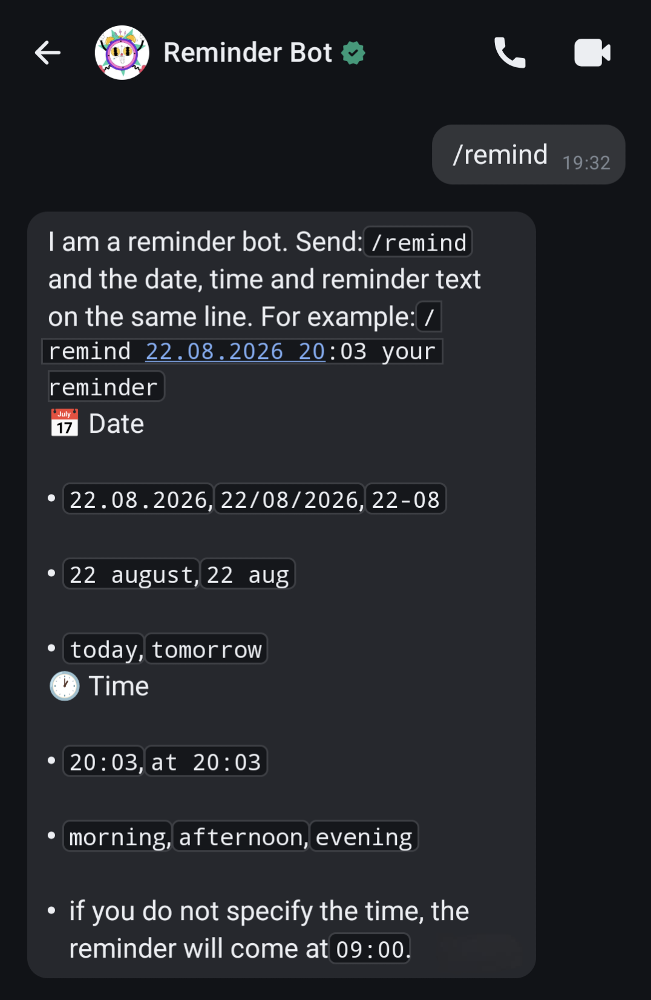
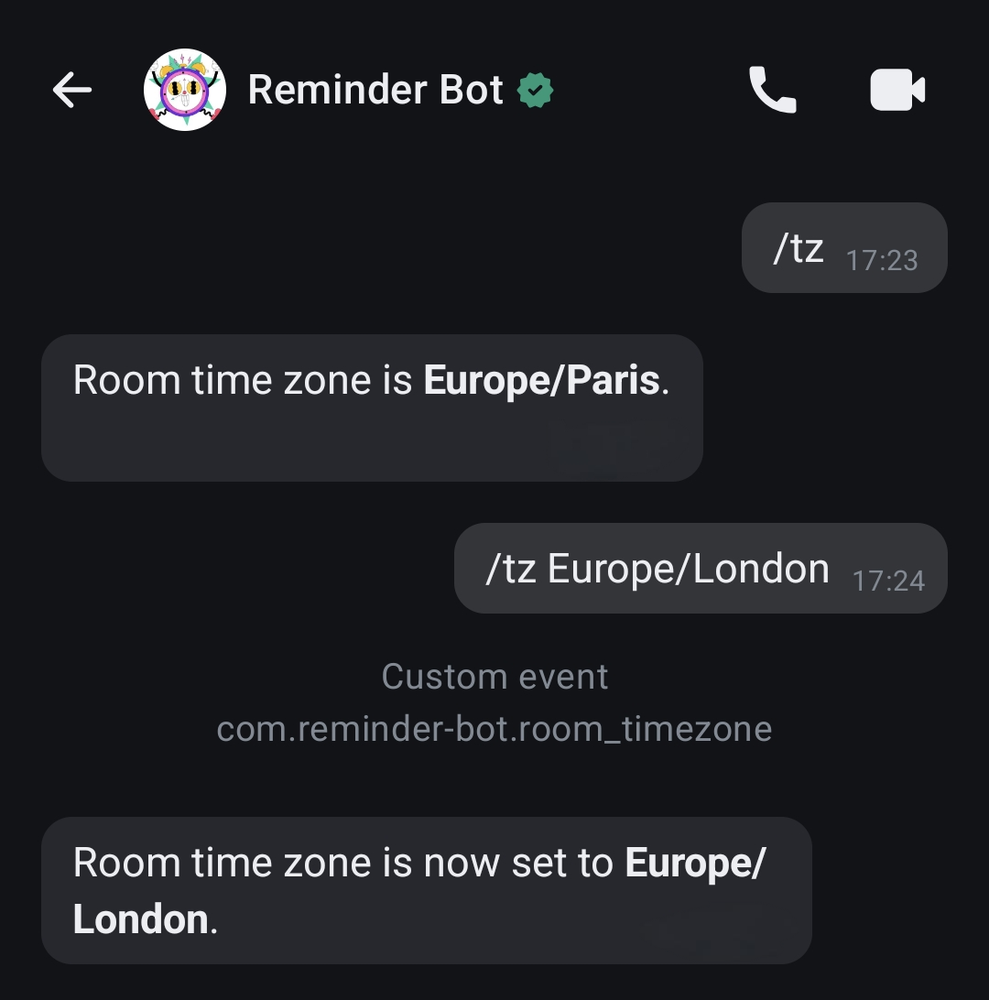

<p align="center">
	
</p>
<p align="center">
	<i>
		Logo credits:  <a href="https://www.flaticon.com/free-stickers/alarm-clock" title="alarm clock stickers">Alarm clock stickers created by Stickers - Flaticon</a>
	</i>
</p>
<br>

[](https://github.com/outarde/reminder-bot/blob/main/LICENSE) [](https://github.com/outarde/reminder-bot/actions) [](https://github.com/outarde/reminder-bot/releases) [](https://github.com/outarde/reminder-bot/commits/main/)

# Remindrix
A lightweight chatbot for reminders on Matrix servers focused on multilingual support and user experience. Schedule reminders on the go in personal or group rooms.
## Key Features
- ⏲️ Create reminders with the `/remind` command.
- 📅 Basic date and time variability with the words `today`, `tomorrow`, `morning`, `afternoon`, `evening`, omitting the year and month.
- 🌐 Individual time zones for rooms by `/tz` command.
- 🔤 Multilingual support both for commands and responses, with the capability to upload custom translations.
- 📋 Send a summary of missed reminders in each room.
- 🎹 Aliases for calling the bot and the ability to call the bot without a command or only by mention.
## Matrix Account Features
- Login to the bot's Matrix account with a password and token, automatic device verification and backup if this is the first device for the account, and receiving a recovery key
- Manual verification with a recovery key if the bot account has been logged in to before, and backup enabled via the command line (CLI)
- Verification of other devices on which the bot is authorized
- Reset all verification settings with the ability to save or delete the backup and receive a new recovery key
## Feature Roadmap
#### Reminders Preferences:
- [x] Optional activation of the bot without a command
- [x] Optional requirement to mention the bot in group chats
- [x] Time zone settings
#### Commands:
- [x] Alternative text for the bot activation command
- [x] Bot’s replies via reactions
- [ ] Deleting reminders
- [ ] Recurring reminders
- [ ] Sending a list of reminders
- [x] Delegation of reminders
#### Language and Translation:
- [x] Adding languages
- [x] Upload your own translation
- [x] Pro/CLI mode
- [ ] More advanced parsing of reminder date and time from user messages
#### Other:
- [ ] Database cleanup settings
- [ ] Learn to not be late
## Screenshots
<table>
  <tr>
	  <td>
		  
	  </td>
	  <td>
		  
	  </td>
	  <td>
		  
	  </td>
	  <td>
		  
	  </td>
      <td>
        
      </td>
  </tr>
  <tr>
    <td>
      <p align="center"><i>Welcome message</i></p>
    </td>
    <td>
      <p align="center"><i>Interaction with the bot</i></p>
    </td>
    <td>
      <p align="center"><i>New reminder</i></p>
    </td>
    <td>
      <p align="center"><i>Summary of missed reminders</i></p>
    </td>
    <td>
      <p align="center"><i>Setting a room's time zone</i></p>
    </td>
  </tr>
</table>

## Quick Start
### Docker Run
```
docker run -d --name reminder-bot --restart unless-stopped \
  -v reminder-bot:/app/data/reminder_bot \
  -e MATRIX_HOMESERVER=homeserver-url \
  -e MATRIX_TOKEN=your-token \
  ghcr.io/outarde/reminder-bot:latest
```
### Docker Compose
For more persistent setup use [docker-compose.yml](https://github.com/outarde/reminder-bot/blob/main/docker/docker-compose.yml).

Set the environment variables as shown in [example.env](https://github.com/outarde/reminder-bot/blob/main/docker/example.env):
1. `MATRIX_HOMESERVER` — Matrix homeserver address.
2. `MATRIX_USERNAME` and `MATRIX_PASSWORD` — bot's username and password. Create a user via Matrix Authentication Service (MAS): `docker exec matrix-auth mas-cli manage register-user USERNAME --password PASSWORD`.
3. `MATRIX_TOKEN` — specify this variable when authenticating via token rather than username and password.

> [!IMPORTANT]
>  Make sure the bot's data folder `/app/data/reminder_bot` is bound to the host in `volumes` section. Otherwise, the bot will create a new session each time it's started.

### Optional Configuration
Language and other additional settings are stored in a `config.yml` file in a folder or volume that you have bound to the `/app/data/reminder_bot` folder inside the container. Use [config.example.yml](https://github.com/outarde/reminder-bot/blob/main/docker/config.example.yml) as a starting point. 

#### Available Languages
`en` English 🇬🇧, `de` German 🇩🇪, `fr` French 🇫🇷, `it` Italian 🇮🇹, `es` Spanish 🇪🇸, `sv` Swedish, aka IKEAish 🇸🇪, `pl` Polish 🇵🇱, `cs` Czech 🇨🇿, `fi` Finnish 🇫🇮, `ja` Japanese 🇯🇵,  `zh` Chinese Simplified 🇨🇳, `ru` Russian 🇷🇺, `uk` Ukrainian 🇺🇦.

You can also upload your [custom translation](https://github.com/outarde/reminder-bot/blob/main/docs/configuration.md#using-a-custom-translation-file).

## Usage
### Start a Chat
Create a conversation with the bot or add it to a room. Send the `/remind`, `!remind` or command in your chosen language to get help:
> I am a reminder bot. Send: `/remind` and the date, time and reminder text on the same line. For example: `/remind 19.08.2026 20:03 your reminder`.
>
> **📅 Date**
> - `19.08.2026`, `19/08/2026`, `19-08`
> - `19 August`, `19 aug`
> - `today`, `tomorrow`
>   
> **🕐 Time**
> - `20:03`, `at 20:03`
> - `morning`, `afternoon`, `evening`
> - If you do not specify the time, the reminder will come at `09:00`
>   
> **⚙️ Commands**
> - Put `/` or `!` at the beginning
> - `r|remind` - create a reminder
> - `tz Europe/Paris` - set the time zone

## Beyond the Quick Start
| ⚙️                                                                                                                                                          | 💬                                                                                                             | ☑️                                                                                                                                                                                                         |
| ----------------------------------------------------------------------------------------------------------------------------------------------------------- | -------------------------------------------------------------------------------------------------------------- | ---------------------------------------------------------------------------------------------------------------------------------------------------------------------------------------------------------- |
| For a full description of bot settings, see the [ configuration.md](https://github.com/outarde/reminder-bot/blob/main/docs/configuration.md) help page. | For details on using the bot, see [usage.md](https://github.com/outarde/reminder-bot/blob/main/docs/usage.md). | For information on interacting with the Matrix homeserver and managing your account, including **device verification**, see [matrix.md](https://github.com/outarde/reminder-bot/blob/main/docs/matrix.md). |

---
I am developing this bot with a focus on users, to make communication via the Matrix protocol more convenient where it is an indispensable option for personal, non-censored communication. You can read more in [this Reddit post](https://www.reddit.com/r/matrixdotorg/comments/1vfs5s9/new_matrix_reminder_bot/). Your suggestions and issue reports are invaluable for me and the 🤖!
